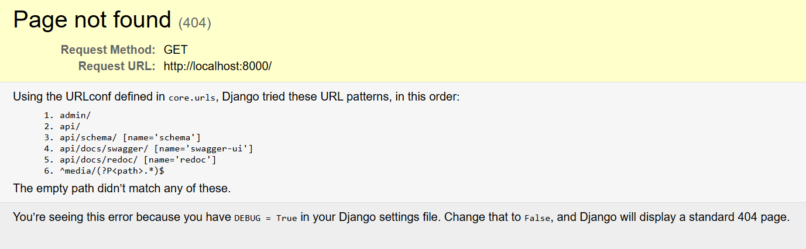
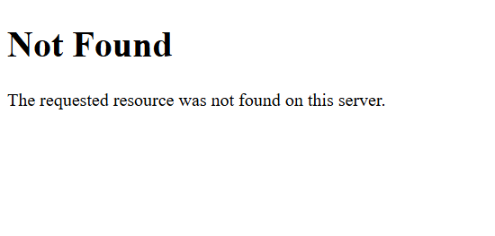
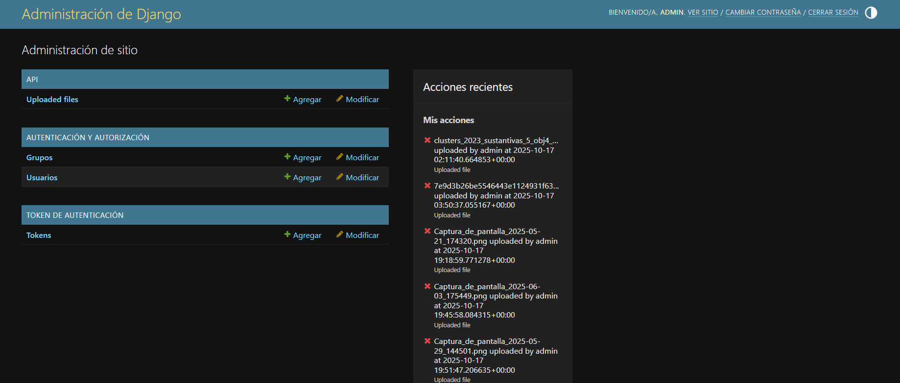
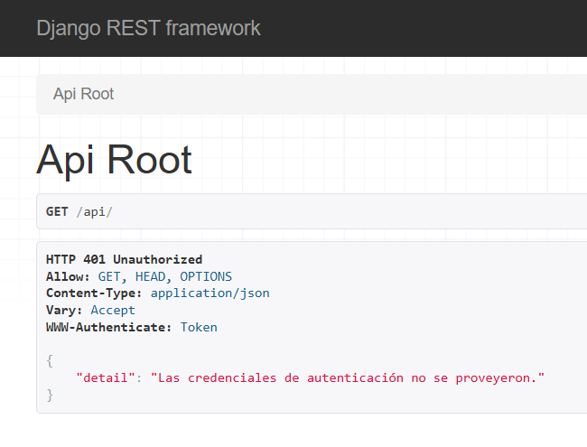
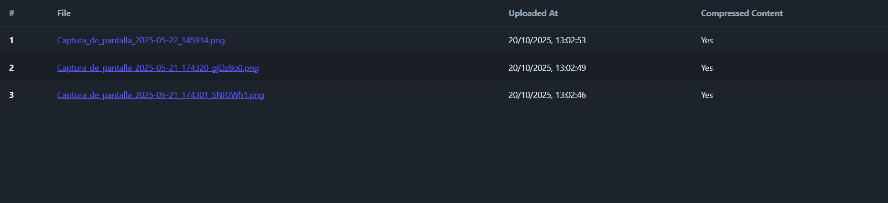
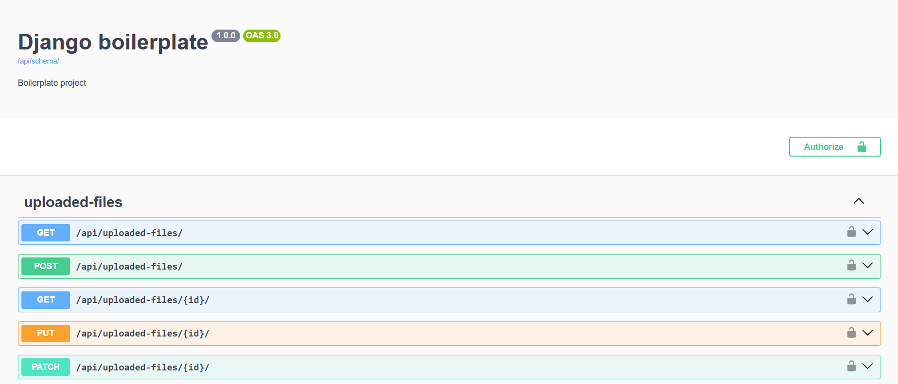
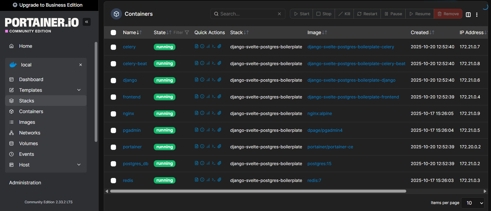
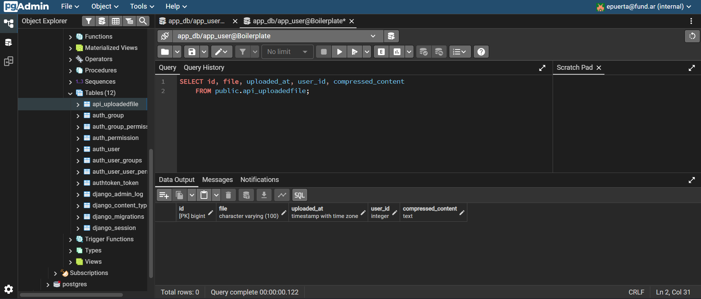

# Django-Svelte-PostgreSQL Boilerplate

Template básico que permite cargar archivos (con límite de 10Mb) mediante el panel de *Django Admin*, usando tareas asíncronas de *Celery+Redis*. Se puede acceder a dicho servicio mediante una *API Django Rest Framework (DRF)*, consumido a traves de una app *SvelteKit*. Todo orquestado mediante *Docker*.


## Tecnologías incluídas

### Orquestación

- **Docker** (docker compose)

### Backend

- **Django:**
  - **Server:** (Gunicorn + Nginx para statics)
  - **Admin:** (django.contrib.admin)
  - **Autenticación y grupos:** (django.contrib.auth)
  - **Api REST:** (djangorestframework)
  - **Serialización:** (DRF Serializers)
  - **Testing:** (pytest)

### Persistencia relacional

- **PostgreSQL**
- **PgAdmin**

### Tareas asíncronas

- **Celery**
- **Redis**

### Frontend

- **SvelteKit:**
  - Consumo de la *API DRF*.
  - Manejo de token de autenticación mediante *env-vars server-side*.

### Logging y administración de contenedores

- **Portainer**

## Stack de servicios desplegados

- postgres_db
- pgadmin
- redis
- django
- celery
- celery-beat
- nginx
- frontend (SvelteKit)
- portainer

## Primeros pasos

```bash
cp .env.sample .env           # Editar el archivo con las variables deseadas
pre-commit install            # Instala el hook de pre-commit
pre-commit run --all-files    # Si se requiere ejecutar el pre-commit manualmente
cd backend
uv sync                       # Instala dependencias Python en el entorno virtual
cd ../frontend
pnpm install                  # Instala dependencias de Svelte
pnpm run dev                  # Crea la carpeta frontend/.svelte-kit y levanta el server dev
docker compose up --build     # -d opcional, para correrlo en background
```

## Variables de entorno

Variables mínimas para desarrollo

```bash
# Configuración para Nginx, quién sirve los archivos estáticos del backend
# y redirige el resto del tráfico a Gunicorn, el server productivo para Django.
NGINX_PORT=8000
BASE_URL=http://localhost:8000

# Configuración para SvelteKit, puerto, dirección de la API Rest en el back
# y el token del usuario "browser".
SVELTEKIT_PORT=5173
API_URL=http://django:8000/api
# Acá debe ir el token obtenido luego de setear BROWSER_TOKEN_FILE y de
# desplegar el stack con docker compose
API_TOKEN=abc123...

# Configuración para Django:
# Clave secreta
DJANGO_SECRET_KEY='django-987xyz...'
# Poner en False para producción
DJANGO_DEBUG='True'
# Hosts aceptados (CORS)
DJANGO_ALLOWED_HOSTS='*'
# Nombre, email y contraseña del superusuario del módulo de administración
DJANGO_SUPERUSER_USERNAME=adminuser
DJANGO_SUPERUSER_EMAIL=adminuser@gmail.com
DJANGO_SUPERUSER_PASSWORD=adminpass
# Nombre y contraseña del usuario que utilizará el cliente Svelte
BROWSER_USERNAME=browser
BROWSER_PASSWORD=securepassword123
# Si se setea la variable BROWSER_TOKEN_FILE, al desplegar docker compose
# se genera un nuevo token para el usuario 'browser', guardado en
# /browser_token/BROWSER_TOKEN_FILE
# Si no se setea, se omite la ejecución del comando (en el mismo comando
# que genera automáticamente los grupos básicos).
# Si se desea revocar el token, lo puede realizar un usuario admin desde
# el módulo administrador de Django.
BROWSER_TOKEN_FILE=

# Configuración de la base de datos PostgreSQL
POSTGRES_DB=app_db
POSTGRES_USER=app_user
POSTGRES_PASSWORD=app_pass
POSTGRES_HOST=postgres_db
POSTGRES_PORT=5432

# Configuración para la interfaz web PgAdmin, nos logueamos con las siguientes
# credenciales y en el primer uso nos pedirá configurar un server Postgres.
# Utilizaremos para ello los datos de la categoría anterior.
PGADMIN_PORT=5050
PGADMIN_DEFAULT_EMAIL=adminuser@gmail.com
PGADMIN_DEFAULT_PASSWORD=adminpass

# Configuración para Redis, broker utilizado por Celery
REDIS_PORT=6379

# Configuración para Celery, gestor de tareas asíncronas
DJANGO_SETTINGS_MODULE=core.settings

# Configuración para Portainer, interfaz web que recolecta estadísticas y logs
# de nuestro stack de contenedores.
PORTAINER_PORT=9000
```

## Arquitectura

```bash
boilerplate
|_ backend                    # engloba todo lo relacionado con el proyecto Python+Django+DRF
|  |_ .venv                   # entorno virtual que se debería generar luego de 'uv sync'
|  |_ api                     # aplicación DRF de ejemplo
|  |  |_ management           # comandos iniciales de Django (usuarios, grupos, tokens)
|  |  |_ migrations           # cambios de modelos (se generan automáticamente)
|  |  |_ tasks                # tareas que se ejecutan mediante Celery+Redis
|  |  |_ admin.py             # registro de modelos en el Django admin
|  |  |_ apps.py              # configuración de la aplicación DRF
|  |  |_ models.py            # modelo de ejemplo
|  |  |_ serializers.py       # especificación para serializar los objetos en JSON
|  |  |_ signals.py           # trigger para lanzar tareas en Celery
|  |  |_ tests.py             # tests de modelos relacionados con la actual aplicación DRF
|  |  |_ urls.py              # acceso al servicio mediante la api DRF
|  |  |_ views.py             # vista del servicio en la api DRF
|  |_ core
|  |  |_ __init__.py          # configuración del servicio Celery
|  |  |_ celery.py            # configuración del servicio Celery
|  |  |_ compression.py       # utilidades usadas por la tarea async de compresión
|  |  |_ field_file_patch.py  # patch para rutas relativas
|  |  |_ logger_config.py     # configuración del loguru para handlear logs de logging
|  |  |_ settings.py          # configuración general de Django
|  |  |_ urls.py              # urls expuestas (Django Admin + Apps DRF)
|  |_ staticfiles
|  |  |_ ...                  # contiene los archivos estáticos del Django Admin y DRF, servidos por Nginx
|  |_ .dockerignore           # ignores específicos para la generación del contenedor 'backend'
|  |_ Dockerfile              # construcción del contenedor 'backend'
|  |_ entrypoint.sh           # comandos que Docker ejecutará por shell al terminar la construcción de la imagen
|  |_ manage.py               # administración del proyecto Django 'backend'
|  |_ pyproject.toml          # metadata y dependencias 'backend'
|  |_ pytest.ini              # configuración de la libreria de testing PyTest
|  |_ uv.lock                 # el proyecto Python 'backend' gestiona sus dependencias mediante UV
|_ browser_token              # se genera seteando BROWSER_TOKEN_FILE
|_ frontend                   # engloba todo lo relacionado con el proyecto SvelteKit
|  |_ src                     # el código fuente del frontend
|  |  |_ lib                  # componentes genéricos, assets, etc
|  |  |_ routes               # las rutas URI en SvelteKit se gestionan dentro, como una jerarquía de carpetas
|  |  |  |_ +layout.svelte    # contenido HTML que se aplicará en todas las rutas subsiguientes (ideal menúes, navbars, etc)
|  |  |  |_ +page.server      # código server-side, consulta la api del backend
|  |  |  |_ +page.svelte      # contenido HTML específico de la ruta actual
|  |  |_ app.css              # estilo CSS global
|  |  |_ app.html             # el HTML base del frontend
|  |_ static                  # archivos estáticos del frontend
|  |_ Dockerfile              # construcción del contenedor 'frontend'
|_ logs                       # logs generados por los contenedores
|_ media                      # volumen mapeado al interior del contenedor 'backend', para ver los archivos subidos
|  |_ ...
|_ nginx                      # configuración del servicio Nginx (sirve los estáticos del back y redirige el tráfico a Django, servido con Gunicorn)
|_ .env.sample                # ejemplo de variables de entorno
|_ .gitignore                 # ignores del repositorio git
|_ docker-compose.yml         # orquestación de containers
|_ LICENSE                    # licencia del proyecto
|_ README.md                  # éste archivo
```

## Accesos por defecto

- Django:
  - App: <http://localhost:8000>

> Con *debugger* activo en *development*
  

> Con *debugger* desactivado en *producción*
  

> Se podría redireccionar la URL al frontend

- Admin: <http://localhost:8000/admin/>
  

- Api DRF: <http://localhost:8000/api/>
  

- SvelteKit:
  - Front: <http://localhost:5173>
  

- Docs:
  - Swagger: UI: <http://localhost:8000/api/docs/swagger/>
  

  - Redoc: <http://localhost:8000/api/docs/redoc/>
  

- Portainer: <http://localhost:9000/#!/init/admin>
  - tiene timeout, asi que hay que acceder rápido o reiniciar su contenedor
  - crear usuario y contraseña y guardarlo en algún lugar seguro
  

- Postgres - PgAdmin: <http://localhost:5050>
  - Configurar un server con los datos de postgresql del .env:
  

- Redis:
  - Por si se necesita acceder al container:
    - docker exec -it redis redis-cli
